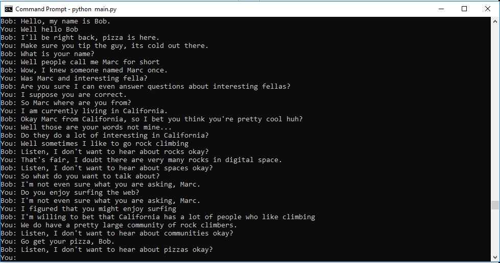

# Basic chat bot (Version 1.2)

## How to install
Download Python 2.7.x - https://www.python.org/downloads/

Download pip `sudo easy_install pip`

Download Virtualenvwrapper `pip install virtualenvwrapper`

Finally,
```commandline
mkvirtualenv chatbot
pip install -r requirements.txt
python main.py
```

## About the bot
This bot will not win any awards but rather is a proof of concept for handling persisting data about the user. The bot can handle a series of tasks and events where, once prompted they will insist that the user answers them and then save the answer into memory.